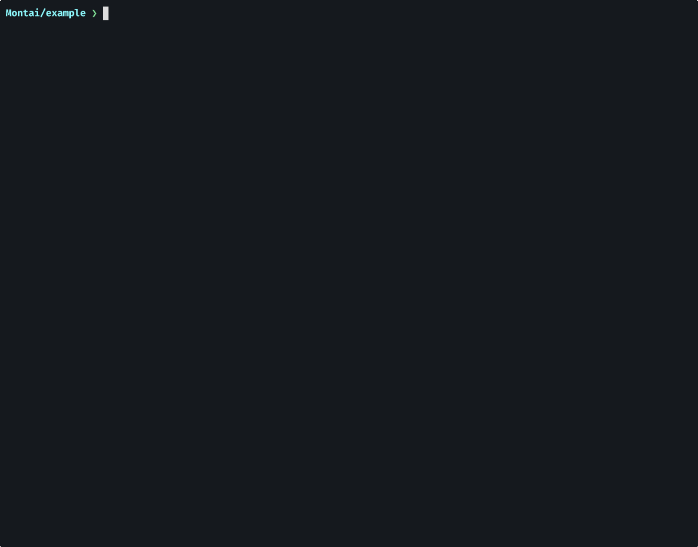

# Montai

[](https://www.npmjs.com/package/montai-cli)

AI-powered video editing tool that extracts storylines from unscripted footage and generates edited vlogs.

See the [MANUAL.md](MANUAL.md) for full documentation.

## Install

```bash
npm install -g montai-cli
```

<details>
<summary>Install from source</summary>

```bash
git clone https://github.com/jysperm/Montai.git
cd Montai
npm ci && npm link
```

</details>

Prerequisites:

- Node.js >= 22 (v20 has a [readline bug](https://github.com/nodejs/node/issues/60446) with CJK input)
- `ffmpeg` and `ffprobe` on PATH (`brew install ffmpeg`)
- [Gemini](https://ai.google.dev/gemini-api/docs/gemini-3) for video analysis and editing, [Lyria 3](https://ai.google.dev/gemini-api/docs/music-generation) for music generation and [Gemini TTS](https://ai.google.dev/gemini-api/docs/speech-generation) for voiceover generation — set `GEMINI_API_KEY` from [Google AI Studio](https://aistudio.google.com/api-keys)

## Interactive Story Editing

The `montai story` command opens an interactive session where you chat with AI to craft your storyline and timeline. You can use any language to iteratively refine the edit — adjust pacing, reorder scenes, add or remove clips, and tweak transitions — all through natural conversation.



### Editing Capabilities

- **Clip trimming** — select segments from any analyzed video with precise start/end times
- **Playback rate** — speed up or slow down individual clips
- **Volume control** — adjust volume per clip
- **Transitions** — fade, slide, and wipe transitions between clips
- **Crop** — static crop to reframe shots
- **Ken Burns** — animated pan & zoom from one crop to another
- **Rotation** — rotate clips to fix footage shot in the wrong orientation
- **Text overlays** — title, subtitle, and caption styles at 6 positions, with fade, slide, and pop entrance animations
- **Background music** — add library music with volume and fade controls, auto-looping with crossfade
- **AI music generation** — generate instrumental background music
- **AI voiceover generation** — write a script and have the AI narrate it (Google Gemini-TTS, or macOS's built-in voices), then place the narration under the footage
- **Mixed orientations** — can also mix landscape and portrait shots in the same timeline, with automatic rotation adjustments
- **Voiceover-driven editing** — match video clips to narration recordings, selecting visuals that fit each spoken segment

### Self-Feedback

- **Inspect a single frame** — view any moment of the current edit as an image to verify how an effect actually looks
- **Watch the edited video** — view a range (or the whole timeline) end-to-end to check pacing, transitions, and overall flow

## Quick Start

1. Create a project directory and put your source videos in a `footage/` subdirectory inside it.

Create `montai.yaml`:

```yaml
assets:
  videos: ./footage
language: en
output:
  resolution: 1080p
  fps: 50
models:
  analysis: gemini-3.8-flash
  editing: gemini-3.8-flash
  musicGeneration: lyria-3-clip-preview # Optional but recommended
```

2. Write your credentials to `~/.config/montai/env`:

```dotenv
GEMINI_API_KEY=...
```

3. Analyze the source media:

```bash
montai analyze
```

4. Start a new interactive story editing session:

```bash
montai story --new
```

Inside the story session, use `/preview` to start Remotion Studio to preview the edited video or `/export` to export FCPXML for Final Cut Pro:

```text
> /preview
Auto preview: on
Remotion Studio: http://localhost:3000

> /export
Auto export (fcp): on
FCPXML exported
```

## Commands

| Command | Description | See Also |
|---------|-------------|---------|
| `montai analyze` | Transcode, upload, and analyze videos, music, and voiceovers | [Analyze Media](MANUAL.md#analyze-media) |
| `montai analyze --re-run [file]` | Re-analyze media file (omit for all) | [Analyze Media](MANUAL.md#analyze-media) |
| `montai analyze --list` | List media analysis status | [Analyze Media](MANUAL.md#analyze-media) |
| `montai analyze --show <file>` | Show one stored media analysis | [Analyze Media](MANUAL.md#analyze-media) |
| `montai project` | Show project overview and stats | [Project Overview](MANUAL.md#project-overview) |
| `montai skills` | List story-agent skills, sources, overrides, and availability | [Skills](MANUAL.md#skills) |
| `montai story` | Open an interactive story editing session (create new or open existing one) | [Interactive Story Editing](MANUAL.md#interactive-story-editing) |
| `montai story --list` | List stories | [Stories](MANUAL.md#stories) |
| `montai story --sessions` | List saved editing sessions | [Sessions](MANUAL.md#sessions) |
| `montai story --resume [id]` | Resume a prior editing session (omit to select interactively) | [Sessions](MANUAL.md#sessions) |
| `montai preview [name]` | Open Remotion Studio for preview (omit for all) | [Live Preview](MANUAL.md#live-preview) |
| `montai export [name]` | Export FCPXML from a timeline (omit for all) | [Export FCPXML](MANUAL.md#export-fcpxml) |
| `montai render [name]` | Render MP4 through Remotion (omit for all) | [Render with Remotion](MANUAL.md#render-with-remotion) |
| `montai [preview \| export \| render] --from-archived` | Use archived videos as source | [Work From Archived Clips](MANUAL.md#work-from-archived-clips) |
| `montai archive` | Archive original video clips referenced by current timelines | [Archive Source Clips](MANUAL.md#archive-source-clips) |
| `montai archive --encode [spec]` | Encode archived clips instead of passthrough copy | [Encoded Archive](MANUAL.md#encoded-archive) |
| `montai clean` | Remove regenerable cache files | [Clean Cache](MANUAL.md#clean-cache) |

Debug logging for LLM calls via the `DEBUG` env var:

```bash
DEBUG=montai:*,-montai:*:verbose montai story    # print each LLM call
DEBUG=montai:* montai story                      # including full message contents
```

## Export .fcpxml

`montai export` generates .fcpxml 1.11 files in the `fcpxml/` directory, which can be imported into professional video editors. .fcpxml preserves clips, transitions, and text overlays, and is recommended over `render` for HDR projects.

### Final Cut Pro (recommended)

First import your video files into Final Cut Pro, then use File → Import → XML to import the `.fcpxml` file. FCP will automatically link the media.


<details>
<summary><h3>DaVinci Resolve</h3></summary>

First import your video files into the Media Pool, then use File → Import → Timeline → Import AAF, EDL, XML, FCPXML to import the `.fcpxml` file. Resolve will automatically match the media to the timeline clips.

</details>

## Archiving

Montai can be used to curate interesting segments from a large amount of raw footage. After creating stories, you may want to delete the original files to free up space. `montai archive` extracts the video segments referenced by all current story timelines into the `archived/` directory (video files only). Timeline checkpoints created with `/mark` are not included unless restored into the current story timeline first.

By default, `montai archive` uses passthrough mode to preserve original quality without re-encoding. Use `--encode` to re-encode using project output settings, or `--encode 720p,crf=20,fps=30,8bit` to customize the encoding spec.

After archiving, use `--from-archived` on `render`, `preview`, or `export` to work from the archived clips instead of the original files. The time offsets are automatically remapped based on the archived filenames.

## Output Compatibility

| | Final Cut Pro | DaVinci Resolve | Remotion |
|---------|---------------|-----------------|----------|
| Color depth | Passthrough 8/10-bit | Passthrough 8/10-bit | 8-bit only |
| Color space | SDR and HDR | SDR and HDR | SDR only |
| Transitions | Fade, slide, wipe | Fade only | Fade, slide, wipe |
| Text overlays & animations | Full with known issues | Centered only, no animations | Full |
| Ken Burns | Yes, not working with rotated | Fallback to static crop | Yes |
| Mixed aspect ratios | Yes | Known issues | Yes |
| Audio fades | Yes | No | Yes |
| Render speed | Fast | Fast | Very slow |
