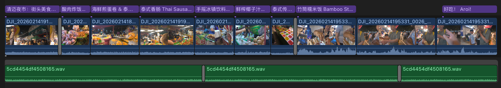

# Montai

AI-powered video editing tool that extracts storylines from unscripted footage and generates edited vlogs.

## Install

```bash
npm install -g montai-cli
```

<details>
<summary>Install from source</summary>

```bash
git clone https://github.com/jysperm/Montai.git
cd Montai
npm ci && npm link
```

</details>

Prerequisites:

- Node.js >= 22 (v20 has a [readline bug](https://github.com/nodejs/node/issues/60446) with CJK input)
- `ffmpeg` and `ffprobe` on PATH (`brew install ffmpeg`)
- [Gemini](https://ai.google.dev/gemini-api/docs/gemini-3) for video analysis and editing (required) — set `GEMINI_API_KEY` from [Google AI Studio](https://aistudio.google.com/api-keys)
- [Lyria 2](https://docs.cloud.google.com/vertex-ai/generative-ai/docs/models/lyria/lyria-002) for music generation (optional) — set `GOOGLE_CLOUD_PROJECT` and `GOOGLE_APPLICATION_CREDENTIALS` from [Google Cloud Console](https://console.cloud.google.com/)

Recommended to use [direnv](https://direnv.net/) to manage environment variables.

## Interactive Story Editing

The `montai story` command opens an interactive session where you chat with AI to craft your storyline and timeline. You can use any language to iteratively refine the edit — adjust pacing, reorder scenes, add or remove clips, and tweak transitions — all through natural conversation.


### Editing Capabilities

- **Clip trimming** — select segments from any analyzed video with precise start/end times
- **Playback rate** — speed up or slow down individual clips
- **Volume control** — adjust volume per clip
- **Transitions** — fade, slide, and wipe transitions between clips
- **Crop** — static crop to reframe shots
- **Ken Burns** — animated pan & zoom from one crop to another
- **Rotation** — rotate clips to fix footage shot in the wrong orientation
- **Text overlays** — title, subtitle, and caption styles at 6 positions, with fade, slide, and pop entrance animations
- **Background music** — add library music with volume and fade controls, auto-looping with crossfade
- **AI music generation** — generate instrumental background music
- **Voiceover-driven editing** — match video clips to narration recordings, selecting visuals that fit each spoken segment

### Self-Feedback

- **Inspect a single frame** — view any moment of the current edit as an image to verify how an effect actually looks
- **Watch the edited video** — view a range (or the whole timeline) end-to-end to check pacing, transitions, and overall flow

## Quick Start

1. Create a project directory with a `montai.yaml` (put your videos in `footage`):

```yaml
assets:
  videos:
    - ./footage
language: en                   # Language for intermediate text (e.g. analysis, storyline)
output:
  resolution: 1080p
  fps: 50
models:
  analysis: gemini-3-flash-preview
  editing: gemini-3-flash-preview
  musicGeneration: lyria-002   # Optional: enables AI generated music (recommended)
effects:
  languages: [zh, en]          # Languages for text overlays, specify multiple for bilingual subtitles
featureFlags:
  transcodeFps: 5              # Optional: transcode at analyzis time to speed up watchSegment calls
```

2. Analyze videos (transcodes, uploads to Gemini and generates per-video summaries):

```bash
montai analyze
```

3. Start an interactive story editing session:

```bash
montai story --new
```

You can start preview by `/preview` or enable auto-export of .fcpxml by `/export` in the interactive session.

```
> /preview
Auto preview: on — Remotion Studio starting in background
Remotion Studio: http://localhost:3000

> /export
Auto export: on
FCPXML exported
```

## Commands

| Command | Description |
|---------|-------------|
| `analyze` | Transcode, upload and analyze videos |
| `project` | Show project overview and stats |
| `story [name]` | Interactive storyline + timeline editing session |
| `story --new` | Create a new story |
| `story --list` | List all stories |
| `export` | Export .fcpxml from a timeline |
| `export --fcp` | Optimize for Final Cut Pro (default) |
| `export --davinci` | Optimize for DaVinci Resolve |
| `render [name]` | Render video via Remotion |
| `preview` | Open Remotion Studio for preview |
| `archive` | Archive original video clips referenced by timelines |

Debug logging for LLM calls via the `DEBUG` env var:

```bash
DEBUG=montai:*,-montai:*:verbose montai story    # print each LLM call
DEBUG=montai:* montai story                      # including full message contents
```

## Archiving

Montai can be used to curate interesting segments from a large amount of raw footage. After creating stories, you may want to delete the original files to free up space. `montai archive` extracts the video segments referenced by all timelines into the `archived/` directory (video files only).

By default, `montai archive` uses passthrough mode to preserve original quality without re-encoding. Use `--encode` to re-encode using project output settings, or `--encode 720p,crf=20,fps=30,8bit` to customize the encoding spec.

After archiving, use `--from-archived` on `render`, `preview`, or `export` to work from the archived clips instead of the original files. The time offsets are automatically remapped based on the archived filenames.

## Export .fcpxml

`montai export` generates .fcpxml 1.11 files in the `fcpxml/` directory, which can be imported into professional video editors. .fcpxml preserves clips, transitions, and text overlays, and is recommended over `render` for HDR projects.

### Final Cut Pro (recommended)

First import your video files into Final Cut Pro, then use File → Import → XML to import the `.fcpxml` file. FCP will automatically link the media.

If your source footage is HDR, make sure the library uses Wide Gamut HDR color processing (Library Inspector → Modify → Wide Gamut HDR) before importing the .fcpxml.



<details>
<summary><h3>DaVinci Resolve</h3></summary>

First import your video files into the Media Pool, then use File → Import → Timeline → Import AAF, EDL, XML, FCPXML to import the `.fcpxml` file. Resolve will automatically match the media to the timeline clips.

If your source footage is HDR (e.g. HLG), enable color management in Project Settings → Color Management, otherwise the output will look washed out. Set Color Science to "DaVinci YRGB Color Managed", enable Automatic Color Management, then choose:

- **Output SDR**: Color Processing Mode "SDR", Output Color Space "Rec.709 Gamma 2.4"
- **Output HDR**: Color Processing Mode "HDR", Output Color Space "HDR HLG"

</details>

## Project Structure

```
my-vlog-project/
  .montai/             # Cache directory
  generated-music/     # AI-generated music files
  archived/            # Archived video clips (montai archive)
  fcpxml/              # Generated .fcpxml files
  output/              # Rendered videos
  montai.db            # Project database
  montai.yaml          # Project config
  AGENTS.md            # Instructions/knowledge for the agent (optional)
```

## Known Issues

- **FCP "The item is not on an edit frame boundary" warning.** Triggered when source footage has embedded timecode and a frame rate different from the sequence (e.g. 59.94fps footage in a 50fps project). Safe to dismiss — titles and audio still land in the correct positions.

## Output Compatibility

|  | Final Cut Pro | DaVinci Resolve | Remotion |
|--|---------------|-----------------|----------|
| Color depth | Passthrough (8/10bit) | Passthrough (8/10bit) | 8bit only |
| Color space | SDR and HDR (HLG/PQ) | SDR and HDR (HLG/PQ) | SDR only (Rec. 709) |
| Transitions | fade, slide, wipe | fade only | fade, slide, wipe |
| Text overlays | All positions | Centered only | All positions |
| Overlay animations | fade, slide, pop | No | fade, slide, pop |
| Ken Burns | Yes | Fallback to crop | Yes |
| Audio fades | Yes | No | Yes |

`preview` and `render` use Remotion, which renders each frame through the browser's canvas (8bit sRGB). HDR metadata and 10bit color depth cannot be preserved.

DaVinci Resolve only reliably imports Cross Dissolve (fade) from .fcpxml — Slide and Wipe transitions fall back to dissolve. Overlay animations and audio fade in/fade out are also ignored by DaVinci. Ken Burns falls back to a static crop at the end frame.
